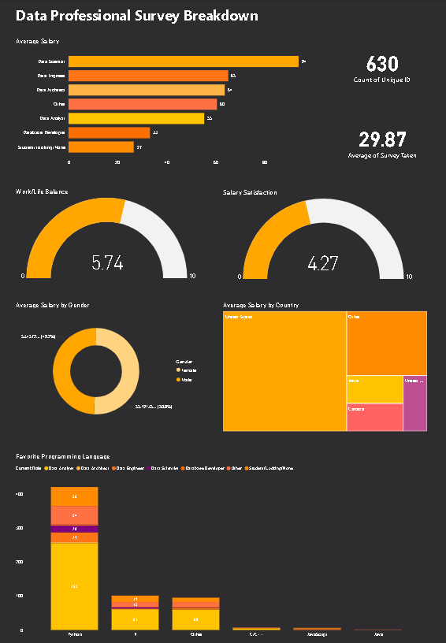

# 📊 Power BI Project – Data Professional Survey Analysis

---

## 📝 Summary

This Power BI project analyzes a dataset of data professionals from various countries, roles, and backgrounds. The goal was to build an interactive dashboard that delivers key insights on salaries, job satisfaction, work-life balance, tools, and programming language preferences within the data industry.

---

## 🔧 What I Did

- Imported and cleaned survey data in **Power BI**
- Created relationships between tables and set up calculated fields
- Built interactive visuals using:
  - **Bar charts**
  - **Donut charts**
  - **Treemaps**
  - **Gauge visuals**
- Designed a clean, dark-themed **dashboard** for better data storytelling

---

## 📚 What I Learned

- Data modeling and transformation in Power BI
- Creating visual summaries from categorical and numerical data
- Applying filters, slicers, and visual-level interactions
- Dashboard layout best practices for clarity and impact

---

## ✅ Result

An interactive dashboard that provides insights such as:
- Average salary by job role, gender, and country
- Count of survey participants
- Work-life balance and salary satisfaction ratings
- Favorite programming languages across different roles

---

## 🌄 Dashboard Preview

---

## 🌱 Future Improvements

- Add slicers for region, experience level, or education
- Include trend analysis over time (if historical data becomes available)
- Use custom DAX measures for deeper KPIs and benchmarking

---

## 📁 Dataset

- **File Used:** `Power BI - Final Project.xlsx`
- Contains raw survey data including roles, salaries, locations, satisfaction ratings, and tools/languages used.

---

## 🔗 Tools Used

- Microsoft Power BI (Desktop)
- Microsoft Excel (Data source)

---

